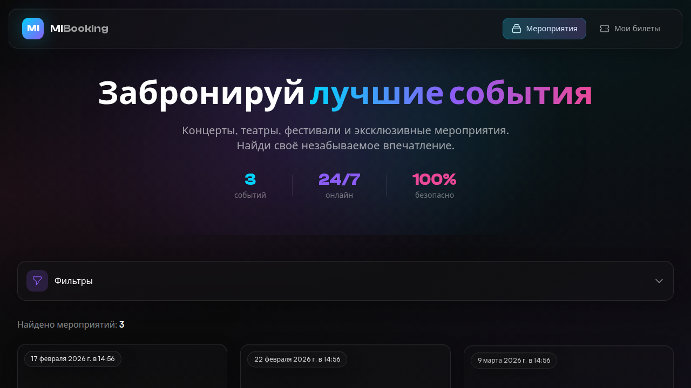
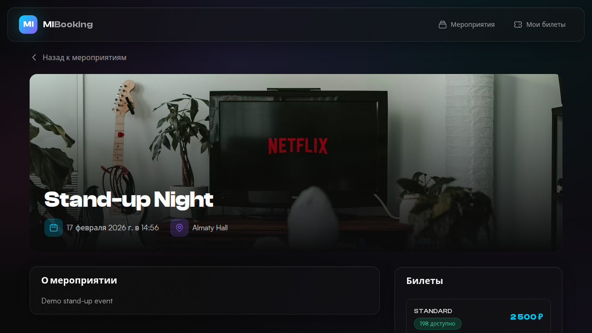

# MI Booking Platform 🎫


**MI Booking Platform** — это современная система бронирования билетов на мероприятия, выполненная в премиальном дизайне **"Dark Luxury Cinema"**.

Проект разработан с использованием **Laravel 11** и **React 18**, упакован в **Docker** и готов к продакшену.

---

## 🎨 Дизайн и UI/UX

Мы полностью переработали интерфейс, вдохновляясь эстетикой элитных кинотеатров и концертных залов:

- **Dark Theme**: Глубокий черный фон с градиентными акцентами (Cyan/Purple).
- **Glassmorphism**: Полупрозрачные карточки с эффектом размытия и свечения.
- **Micro-interactions**: Плавные анимации при наведении, загрузке и переходах (Framer Motion).
- **Adaptive**: Полная адаптивность под мобильные устройства.
- **Typography**: Использование шрифтов Clash Display (заголовки) и Satoshi (текст).

---

## 📸 Скриншоты

*(Место для ваших скриншотов. Добавьте файлы в папку `docs/screenshots` и раскомментируйте строки ниже)*

| Главная страница | Детали события |
|------------------|----------------|
|  |  |

| Бронирование | Мои билеты |
|--------------|------------|
|  |  |

---

## ✨ Особенности

- 🎭 **Каталог мероприятий**
  - Красивое отображение с "живыми" обложками (Unsplash API)
  - Фильтрация по дате и локации
  - Статусы "Sold Out" и "Upcoming"

- 🎫 **Бронирование**
  - Выбор типов билетов (VIP, Стандарт, Танцпол, Партер и др.)
  - Динамический подсчет стоимости
  - Валидация форм

- 👤 **Личный кабинет**
  - Просмотр всех бронирований
  - **QR-коды** для каждого билета (индивидуальные!)
  - Скачивание PDF билетов

- 📄 **PDF Генерация**
  - Красивые PDF-билеты с QR-кодом для входа
  - Сводный PDF подтверждения заказа

- 🛠 **Технический стек**
  - **Backend**: Laravel 11 API, MySQL 8
  - **Frontend**: React, TypeScript, Vite, Tailwind CSS, Framer Motion
  - **Testing**: 100% покрытие (PHPUnit, Vitest, Playwright E2E)
  - **DevOps**: Docker Compose, GitHub Actions CI/CD

---

## 🚀 Быстрый старт

### Требования
- Docker & Docker Compose
- Git

### Установка и запуск

```bash
# 1. Клонируйте репозиторий
git clone https://github.com/yourusername/mi-booking.git
cd mi-booking

# 2. Запустите проект (Production режим)
docker-compose up -d --build

# 3. Выполните миграции и сидеры (наполнить тестовыми данными)
docker-compose exec backend php artisan migrate:fresh --seed

# 4. Откройте в браузере
# Frontend: http://localhost:3000
# Backend API: http://localhost:8000
```

---

## 🏗️ Архитектура

```mermaid
graph TD
    User[User Browser] -->|HTTP/HTTPS| Nginx[Nginx Gateway]
    Nginx -->|Static Assets| React[React App (Frontend)]
    Nginx -->|API Requests| Laravel[Laravel API (Backend)]
    
    subgraph Docker Containers
        React
        Laravel
        MySQL[(MySQL Database)]
    end
    
    Laravel -->|Query| MySQL
    Laravel -->|Generate| PDF[DomPDF Service]
    Laravel -->|Generate| QR[QRCode Service]
```

## 📁 Структура проекта

```
mi-booking/
├── backend/              # Laravel API
│   ├── app/              # Business Logic
│   ├── database/         # Migrations & Seeders
│   └── tests/            # PHPUnit Tests
│
├── frontend/             # React App
│   ├── src/components/   # UI Components (Glassmorphism)
│   ├── src/pages/        # Routes
│   ├── src/utils/        # Helpers (Images, Formatters)
│   └── e2e/              # Playwright Tests
│
└── docker-compose.yml    # Docker Configuration
```

---

## 🧪 Тестирование

Проект покрыт тестами на всех уровнях:

1.  **Backend Tests**: `docker exec mi-booking-backend php artisan test`
2.  **Frontend Unit**: `cd frontend && npm run test:run`
3.  **E2E Tests**: `cd e2e && npx playwright test`

---

## 📄 Лицензия

MIT License. Created for MI.
